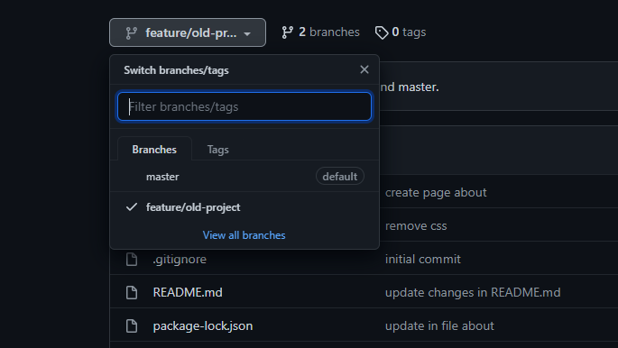

## Para rodar a aplicação siga os passo abaixo

 **ATENÇÃO**
 - Para clonar o repositório sem a parte de estilização e css é necessário selecionar a branch `feature/old-project`, logo certifique-se que foi selecionando essa branch antes de fazer o clone repositório.

 

- 1 Realizar o clone da aplicação

```bash
  git clone https://github.com/jairoevaristo/pratica-web.git
```

- 2 Entrar na pasta do projeto

```bash
  cd pratica-web
```

- 3 Baixar as dependências

```bash
  npm install
```
- 4 Subir o servidor web

```bash
  npm start
```

Por fim acesse o endereço `localhost:3000/home` onde o projeto está rodando
